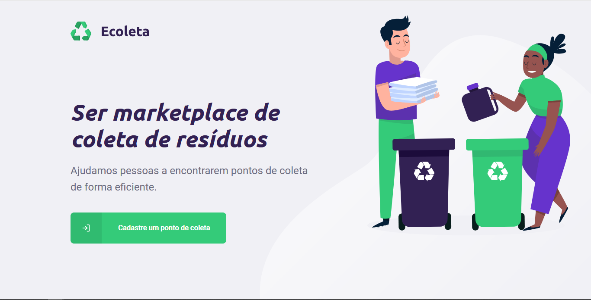
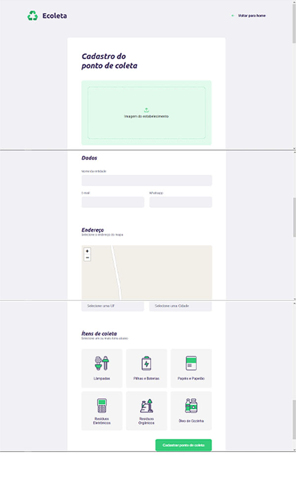
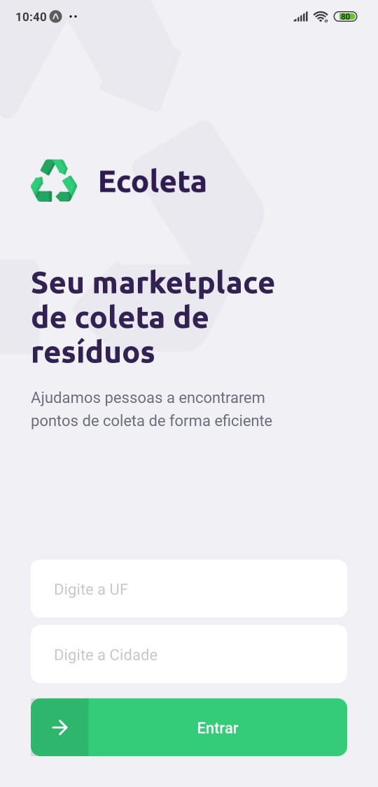
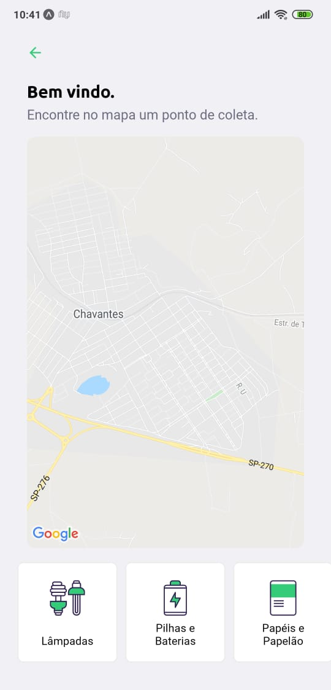
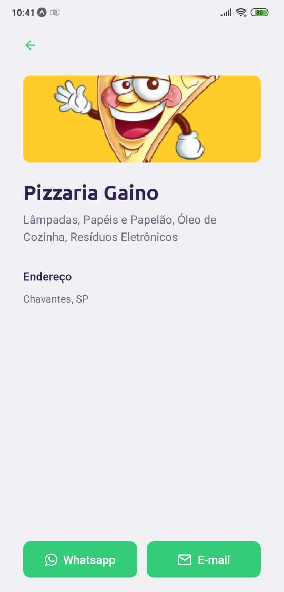

Read this page in English or [Leia essa página em Português](https://github.com/JoaoptGaino/nlw-01/blob/master/READMEpt.md)
# 🚀 NLW-01
Project created during the Next Level Week, the week that gave me and all students a boost through the NodeJS,ReactJS,React Native stack.
<small>This week is a free course made by [RocketSeat](https://rocketseat.com.br)</small>

# 📑About the project
The project name is ***Ecoleta***, i'ts a website that you can register waste collection points all over Brazil.<br>
The Mobile app that is also called ***Ecoleta*** is where you can see the collection points and send message to the place owner's Whatsapp or send him an email. 

# 🌐 Web app

Home Page:

Register page:


# 📱 Mobile app

Home Page:

Points Page:

Point Detail Page:



# 🛠 Main Technologies
The project was developed with these technologies:

- [ReactJS](https://reactjs.org)
- [React Native](https://reactnative.dev/)
- [Express](https://expressjs.com/)

# ⚙ Installing
```bash
    #Clone repo
    $ git clone https://github.com/JoaoptGaino/nlw-01/

    #Enter repo directory
    $ cd nlw-01

    #Install dependencies
    $ npm install

    #Init project
    $ npm start

```

# ✍Authors
- **João Pedro Theodoro Gaino**:
    - [GitHub](https://github.com/JoaoptGaino)
    - [Linkedin](https://www.linkedin.com/in/jo%C3%A3o-pedro-theodoro-gaino-b447a6178/)

# Thanks
Big thanks to all of the people from [RocketSeat](https://rocketseat.com.br), you guys are awesome and all of your free content are the greatest. The next bootcamp I'll be there.