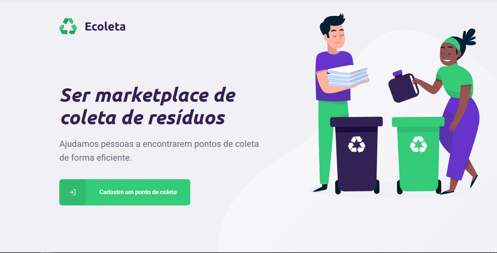
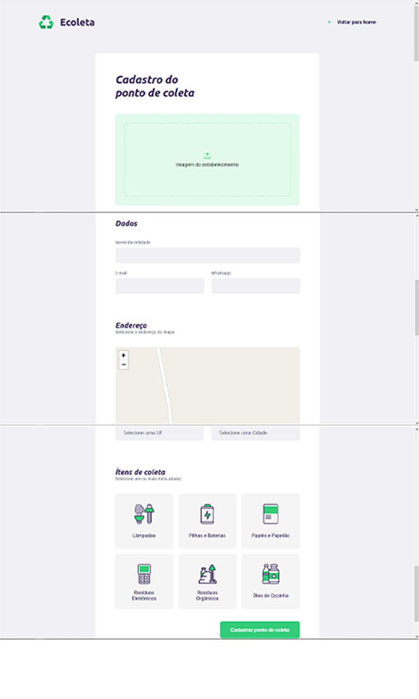
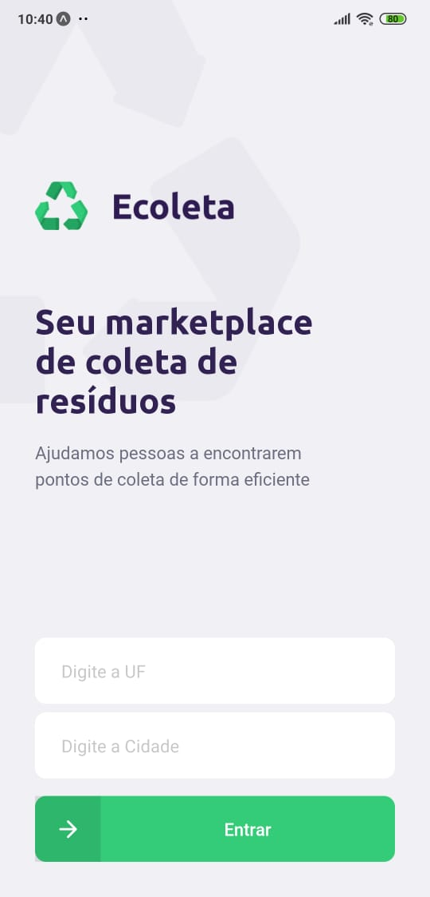
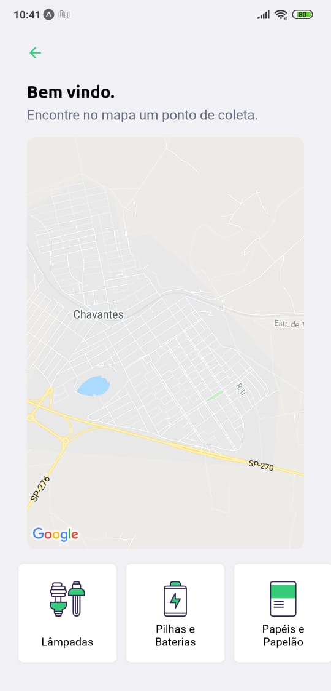

[Read this page in English](https://github.com/JoaoptGaino/nlw-01/blob/master/README.md) or [Leia essa página em Português](https://github.com/JoaoptGaino/nlw-01/blob/master/READMEpt.md)
# 🚀 NLW-01
Projeto criado durante a Next Level Week,
a semana que deu a mim e a todos os participantes um boost na stack NodeJS, ReactJS e React Native.
<small>Essa semana é um curso de tempo limitado disponilizado pela [RocketSeat](https://rocketseat.com.br)</small> totalmente gratuito.

# 📑Sobre o projeto
***Ecoleta*** é um site que permite registrar pontos de coleta de resíduos por todo o Brasil.<br>
Pelo aplicativo Mobile você pode ver os pontos de coleta que estão perto de você ou outros e mandar mensagem por Whatsapp ou email para o estabelecimento. 

# 🌐 Web app

Home Page:

Register page:


# 📱 Mobile app

Home Page:





# 🛠 Main Technologies
The project was developed with these technologies:

- [ReactJS](https://reactjs.org)
- [React Native](https://reactnative.dev/)
- [Express](https://expressjs.com/)

# ⚙ Installing
```bash
    #Clone repo
    $ git clone https://github.com/JoaoptGaino/nlw-01/

    #Enter repo directory
    $ cd nlw-01

    #Install dependencies
    $ npm install

    #Init project
    $ npm start

```

# ✍Authors
- **João Pedro Theodoro Gaino**:
    - [GitHub](https://github.com/JoaoptGaino)
    - [Linkedin](https://www.linkedin.com/in/jo%C3%A3o-pedro-theodoro-gaino-b447a6178/)

# Thanks
Big thanks to all of the people from [RocketSeat](https://rocketseat.com.br), you guys are awesome and all of your free content are the greatest. The next bootcamp I'll be there.